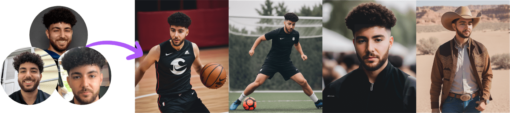
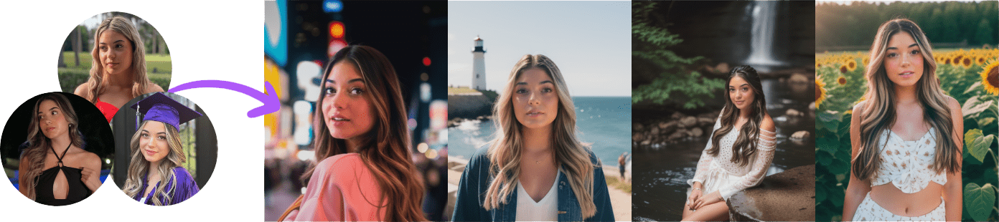
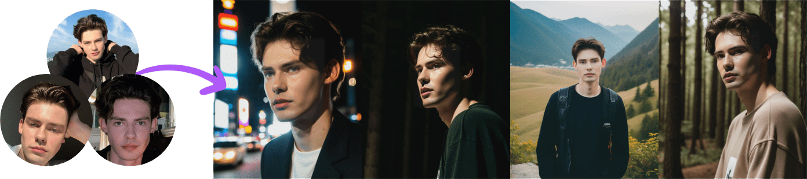
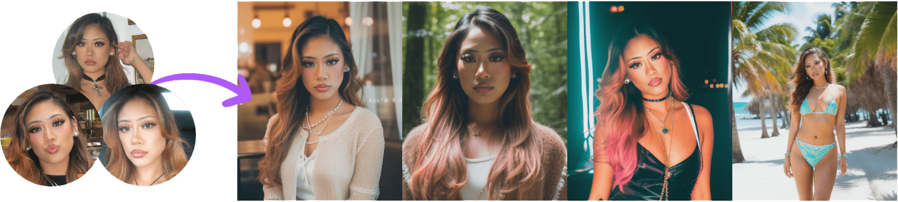
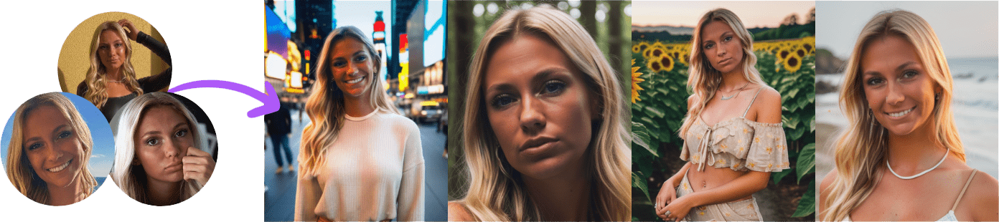
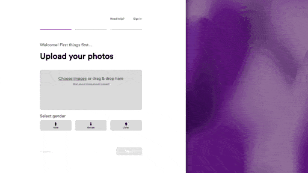
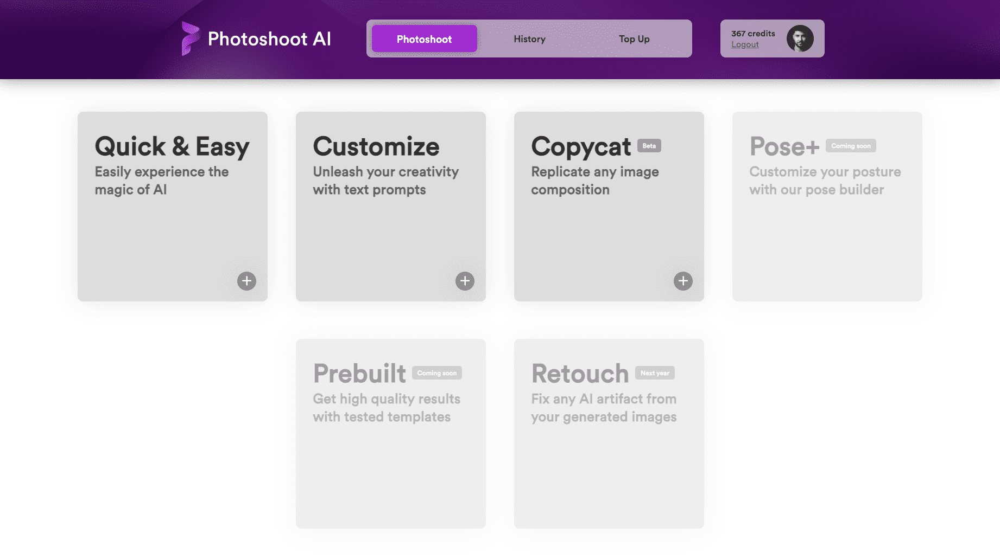
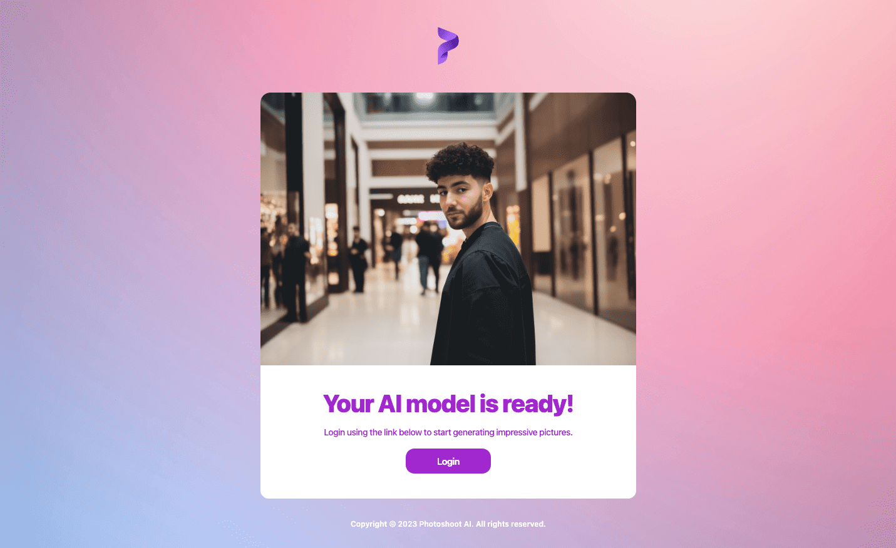

# Photoshoot AI

### Main features:

- Utilizes [Dreambooth](https://arxiv.org/abs/2208.12242), a cutting-edge approach for fine tuning text-to-image diffusion models for subject-driven generation
- Training on a [custom base model](https://huggingface.co/TahaRhidouani/photoshoot-ai/blob/main/base-model.ckpt), utilizing custom regularization images for [men](https://huggingface.co/TahaRhidouani/photoshoot-ai/blob/main/regularization-images-man.zip), [women](https://huggingface.co/TahaRhidouani/photoshoot-ai/blob/main/regularization-images-woman.zip) & [other](https://huggingface.co/TahaRhidouani/photoshoot-ai/blob/main/regularization-images-other.zip), and a custom prediction pipeline
- Provides near-infinite customizability and high quality image generation utilizing techniques such as mask in-painting, [ControlNet](https://github.com/lllyasviel/ControlNet) and smart upscaling
- Web application offers flexible and secure authentication using Google, Microsoft, Facebook or encrypted email & passwords
- Features a secure payment system utilizing Apple Pay, Google Pay, Alipay, Affirm and card input using Stripe
- Sends automated emails for password reset requests, or for timely notifications, such as alerts when the custom AI model is ready for the user
- Leverages MongoDB for efficient user data storage and AWS S3 for scalable storage of images
- Showcases a visually stunning and modern user interface, incorporating smooth animations and mobile responsivness

 

**Generates high quality photos from selfies**

      

 

**Smooth and inviting homepage**

 

**Easy setup process**

 

**Intuitive image generation UI**

 

**Extensive image generation dashboard**

 

**Automated custom emails for timely notifications**

 
